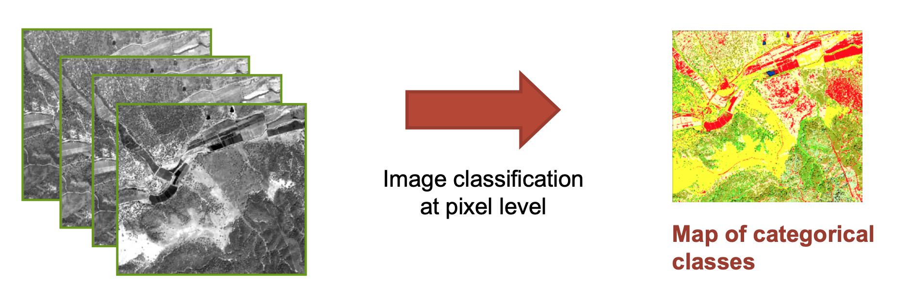
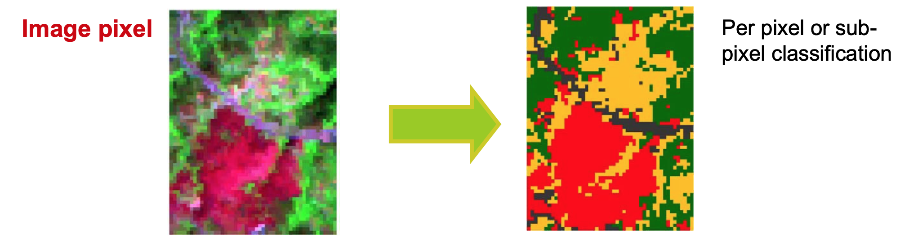

 ## Next Steps {#nextsteps}

[<i class="eye"></i>](https://nicolasdeffense.github.io/eo-toolbox/notebooks/7_Classification/random_forest_classification.html)
[<i class="download"></i>](https://nicolasdeffense.github.io/eo-toolbox/notebooks/7_Classification/random_forest_classification.ipynb)

The classification step consists in one or many numerical processes to finally allocate every pixel or object to one of the classes of the land cover typology. The vast diversity of classification algorithms can be split into two main types:
- the supervised type, which uses a training data set to calibrate the algorithm a priori;
- and the unsupervised type, which produces clusters of pixels to be labelled a posteriori as land cover class in light of in situ or ancillary information.

## Classification based on Random Forests

Random Forest (RF), an improved implementation of Decision Trees (DT), is an ensemble-learning algorithm that combines multiple classifications of the same data to produce higher classification accuracies than other forms of DT (Cutler et al., 2007; Ghimire et al., 2012). RF works by fitting many DT-based classifications to a data set, and then uses a rule-based approach to combine the predictions from all the trees. During this process, individual trees are grown from differing subsets of training data using a process called “bagging”. Bagging involves the random subsampling (with replacement) of the original data for growing each tree. Generally, for each tree grown, two thirds of the training data are used to grow the tree, while the remaining one third are left unused (out-of-bag, or OOB) for later error assessment (Breiman, 2001). A classification is then fit to each bootstrap sample; however, at each node (split), only a small number of randomly selected predictor variables are used in the binary partitioning (Rodriguez-Galiano and Chica-Olmo, 2012). The splitting process continues until further subdivision no longer reduces the Gini index (Cutler et al., 2007). Each tree contributes to the assignment of the most frequent class to the input data with a single vote (Breiman, 1984; Rodriguez-Galiano and Chica-Olmo, 2012). The predicted class of an observation is calculated by the majority vote for that observation, with ties split randomly (Cutler et al., 2007).

[Watch this video if RF are not clear for you !](https://www.youtube.com/watch?v=J4Wdy0Wc_xQ&t=313s)

In this chapter we will see how to use the Random Forest implementation provided by the `scikit-learn` library. Scikit-learn is an amazing machine learning library that provides easy and consistent interfaces to many of the most popular machine learning algorithms. It is built on top of the pre-existing scientific Python libraries, including NumPy, SciPy, and matplotlib, which makes it very easy to incorporate into your workflow. The number of available methods for accomplishing any task contained within the library is its real strength.

<figure class="image">
  
  <figcaption>Image classification</figcaption>
</figure>

### Pixel-based classification

### Object-based classification

---

[Handbook on remote sensing for agricultural statistics](https://www.researchgate.net/publication/319876837_Handbook_on_remote_sensing_for_agricultural_statistics)

[Chris Holden's tutorial](https://ceholden.github.io/open-geo-tutorial/python/chapter_5_classification.html)
