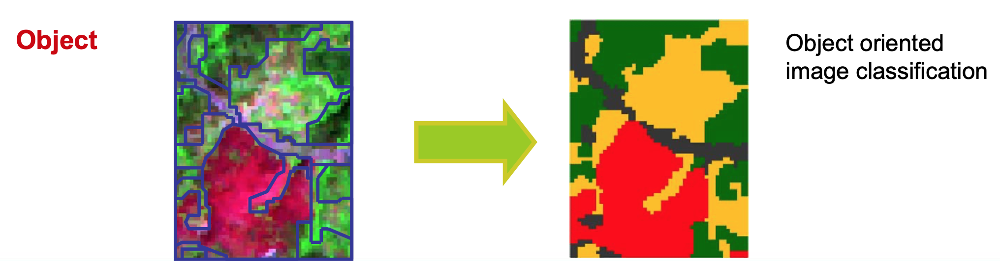

# 1. *In situ* sampling design

[> Downolad notebook](https://nicolasdeffense.github.io/eo-toolbox/notebooks/7_Classification/in_situ_sampling_design.ipynb)

# 2. Classification

In this chapter we will see how to use the Random Forest implementation provided by the `scikit-learn` library. Scikit-learn is an amazing machine learning library that provides easy and consistent interfaces to many of the most popular machine learning algorithms. It is built on top of the pre-existing scientific Python libraries, including NumPy, SciPy, and matplotlib, which makes it very easy to incorporate into your workflow. The number of available methods for accomplishing any task contained within the library is (in my opinion) its real strength. No single algorithm is best for all tasks under all circumstances, and scikit-learn helps you understand this by abstracting the details of each algorithm to simple consistent interfaces.

This following figure shows the classification predictions and the decision surfaces produced for three classification problems using 9 different classifiers.

## 2.1 Pixel-based classification

## 2.2 Object-based classification

# 3. Validation

[Credit](https://ceholden.github.io/open-geo-tutorial/python/chapter_5_classification.html)
