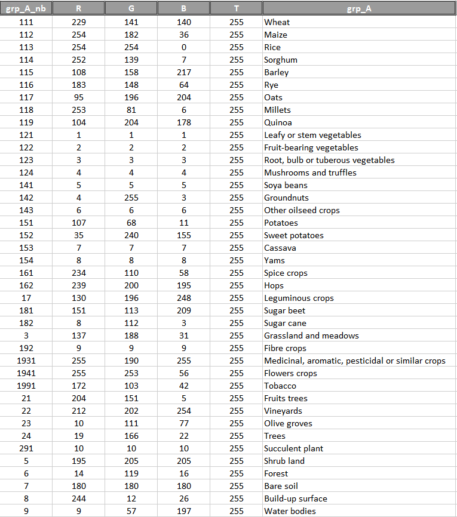

<a href="https://nicolasdeffense.github.io/eo-toolbox/notebooks/C_Color_Map/color_map.html"> <i class="fas fa-eye fa-lg"></i></a>
<a href="https://nicolasdeffense.github.io/eo-toolbox/notebooks/C_Color_Map/color_map.ipynb"> <i class="fas fa-download fa-lg"></i></a>

Now that you’ve got a map, you need to be able to print it or to export it to a document. Luckily, QGIS can export its map file to a format that anyone’s computer can read, as well as printing out the map if you have a printer connected. Both exporting and printing is handled via the [Print Layout](https://docs.qgis.org/3.16/en/docs/training_manual/map_composer/map_composer.html).

If the classification has many classes, it may be useful to create a Color Map file to easily draw a legend to the classification with the right colours and labels.

<figure class="image">
  
  <figcaption>Color Map</figcaption>
</figure>