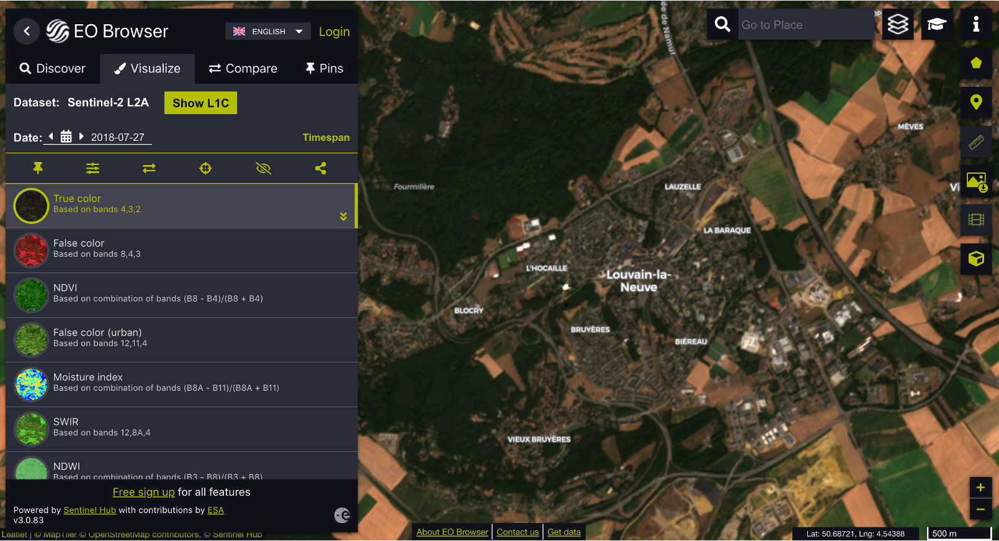
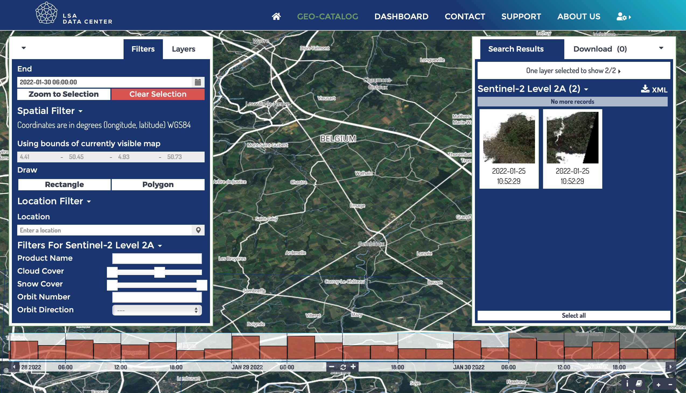

Once the ROI (*Region of Interest*) has been defined, the Earth Observation (*EO*) data must be downloaded. 

# 1. Sentinel Hub EO Browser *- visualisation only*

[EO Browser](https://www.sentinel-hub.com/explore/eobrowser/) allows you to visualize satellite data from numerous satellites and data collections instantly. The process in the background takes care of the selection of appropriate scenes, download and processing of data, as well as mosaic creation. You simply go to your area of interest, select your desired time range and cloud coverage, and inspect the resulting data in the browser.

> <i class="fas fa-exclamation-triangle"></i> It is NOT recommended to download EO data from this site.

<figure class="image">
  
  <figcaption>Sentinel Hub EO Browser</figcaption>
</figure>

# 2. Luxembourg Space Agency Data Center

The [Luxembourg Space Agency Data Center](https://collgs.lu)  is the Luxembourg entry point to data products of Sentinel 1 and Sentinel 2 constellations.

The LSA Data Center allows the users to search, discover and download the data. To this purpose all the data are referenced and indexed in a real time updated geo-catalogue. The catalogue allows the users to query the archive on the basis of specific criteria such as product type, orbit, cloud coverage or polarisation mode and to select the needed products for the download.

> <i class="fas fa-exclamation-triangle"></i> Only Sentinel-2 Level 2A and Sentinel-1 Level 1 (GRD) are available via the LSA Data Center. 

<figure class="image">
  
  <figcaption>LSA Geo-Catalogue</figcaption>
</figure>

# 3. Copernicus Open Access Hub - SciHub

The [Copernicus Open Access Hub](https://scihub.copernicus.eu) provides complete, free and open access to Sentinel-1, Sentinel-2, Sentinel-3 and Sentinel-5P user products.

> <i class="fas fa-exclamation-triangle"></i> Most recently published products are kept online according to a sliding window period of **at least one month**. At the end of the retention period, products are removed from the online storage. The information on the product is kept on the catalogues. The products are tagged on the GUI with an "offline" label. The download request of an offline product, automatically triggers the request for restoring the product back online from the historical archive. Once restored (eg: online) the product(s) can be downloaded by the user. Download of restored products does not start automatically. It needs to be initiated as a normal download. [More info about data restoration](https://scihub.copernicus.eu/userguide/DataRestoration)

## 3.1 Download from the Graphical User Interface

<figure class="image">
  
  <figcaption>SciHub Graphical User Interface</figcaption>
</figure>

## 3.2 Download from the sentinelsat Python API

`sentinelsat` makes searching, downloading and retrieving the metadata of Sentinel satellite images from the *Copernicus Open Access Hub* easy.

### *Sentinel-2*

<a href="https://nicolasdeffense.github.io/eo-toolbox/notebooks/2_EO_data_download/S2_data_download.html"> <i class="fas fa-eye fa-lg"></i></a>
<a href="https://nicolasdeffense.github.io/eo-toolbox/notebooks/2_EO_data_download/S2_data_download.ipynb"> <i class="fas fa-download fa-lg"></i></a>

### *Sentinel-1*

<a href="https://nicolasdeffense.github.io/eo-toolbox/notebooks/2_EO_data_download/S1_data_download.html"> <i class="fas fa-eye fa-lg"></i></a>
<a href="https://nicolasdeffense.github.io/eo-toolbox/notebooks/2_EO_data_download/S1_data_download.ipynb"> <i class="fas fa-download fa-lg"></i></a>
