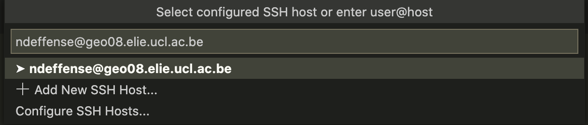

<figure class="image">
    
</figure>

**JupyterLab** is the latest web-based interactive development environment for notebooks, code, and data. Its flexible interface allows users to configure and arrange workflows in data science, scientific computing, computational journalism, and machine learning. A modular design invites extensions to expand and enrich functionality.

# For students without access to the lab's IT infrastructure

## From computer room

1. Open *Anaconda Prompt*

2. Navigate to the disk where the environment was created
    ```sh
    X:
    ```

3. Activate **SISE** environment
    ```sh
    conda activate sise
    ```

4. Launch Jupyter-Lab
    ```sh
    jupyter lab
    ```

5. Close Jupyter-Lab  
    `CTRL-C`  
    `CTRL-C`


## From your personal computer

> ! Requires stockage to install Miniconda (or Anaconda) and the necessary packages !

1. Download Miniconda (or Anaconda)  

    I recommend to use the `conda` package manager to install all the requirements. You can install [Miniconda](https://docs.conda.io/en/latest/miniconda.html) or install the (larger) [Anaconda](https://www.anaconda.com/products/individual) distribution.

    > `conda` is a powerful package manager and environment manager that you use with command line commands at the Anaconda Prompt for Windows, or in a terminal window for macOS or Linux.

    [Getting started with conda](https://conda.io/projects/conda/en/latest/user-guide/getting-started.html)

    You can also check the [conda cheat sheet](cheat_sheets/conda_cheat_sheet.pdf) to get an overview of all commands.

2. Download the YAML file [env_lbrat2104.yml](installation/env_lbrat2104.yml)

3. Open *Anaconda Prompt* (Windows) or *Terminal* (MacOS)

4. Create a conda envrionment from YAML file
    ```sh
    conda env create --file env_lbrat2104.yml
    ```

    The following python packages/libraries are now installed :
    - [numpy 1.19.2](https://numpy.org)
    - [pandas 1.1.5](https://pandas.pydata.org)
    - [geopandas 0.8.1](https://geopandas.org/)
    - [matplotlib 3.3.4](https://matplotlib.org)
    - [rasterio 1.1.0](https://rasterio.readthedocs.io/en/latest/intro.html)
    - [rasterstats 0.14.0](https://pythonhosted.org/rasterstats/)
    - [scipy 1.5.2](https://www.scipy.org/about.html)
    - [scikit-learn 0.24.1](https://scikit-learn.org/stable/)
    - [jupyter lab](http://jupyter.org)


5. Activate **LBRAT2104**'s environment
    ```sh
    conda activate lbrat2104
    ```

6. Download other libaries with `pip`

    > Some libraries can not be installed with `conda` and must be installed through `pip`

    For instance, to install [sentinelsat](https://sentinelsat.readthedocs.io/en/stable/index.html) you must launch this command :

    ```sh
    pip install sentinelsat
    ```

7. Test the environment (optional)

    To make sure everything was installed correctly you can run the small python script [check_environment.py](installation/check_environment.py)

    ```sh
    python3 check_environment.py
    ```

8. Launch Jupyter-Lab
    ```sh
    jupyter lab
    ```

# For students with access to the lab's IT infrastructure

## From Linux server - RECOMMANDED

1. [Install](https://code.visualstudio.com/download) the code editing - Visual Studio Code in your personnal computer (PC or Mac)

2. Install **Remote - SSH** extension to open any folder on a remote machine using SSH

    

3. Select **Remote-SSH: Connect to Host...** from the Command Palette (F1, ⇧⌘P) and type `user@geo08.elie.ucl.ac.be`. Then, you have to select the platform of the remote host, in this case it is **Linux**. You also need to type your password.

    

4. After a moment, VS Code will connect to the SSH server and set itself up. If the connection is successful, you will see it at the   bottom left of your screen.

    

5. You can then open any folder on the remote machine using **File > Open...** just as you would locally!

        

6. Visual Studio Code supports working with Jupyter Notebooks natively. Click [here](https://code.visualstudio.com/docs/datascience/jupyter-notebooks) to get more information.
    > You may need to install **Jupyter** and **Jupyter Notebook Renderers** extension !

7. Visual Studio Code includes a fully-featured integrated terminal. You can directly use this terminal to browse your files or to install python libraries using `pip install {library_name}`.  
To open the terminal:
    - Use the ⌃` keyboard shortcut with the backtick character.
    - Use the View > Terminal menu command.
    - From the Command Palette (⇧⌘P), use the View: Toggle Terminal command.
    - You can create a new terminal via the Terminal menu with Terminal > New Terminal   


## From Windows server

1. Connect to Windows server Geo14 (*geo14.elie.ucl.ac.be*)

    > Only available to students doing their master thesis with Pierre Defourny  
    > *Don't forget to activate your VPN if you're not connected in eduroam WIFI !*

2. Open *Anaconda Prompt*

3. Activate **LBRAT2104**'s environment
    ```sh
    conda activate G:\conda_env\lbrat2104
    ```
    *The name of the environment must appear before the name of the disk*  
    `(G:\conda_env\lbrat2104) C:\>`

4. Go to home disk, the disk where you stored all you data
    > The home disk (\\\\geo12\homes) must be map before (via *This PC > Map network drive...*)   
    > You can map the disk with another letter than H

    ```sh
    H:
    ```

5. Launch Jupyter-Lab
    ```sh
    jupyter lab
    ```
    > By default, Jupyter Lab opens in Internet Explorer and this does not work. You need to copy the URL link and paste it into Google Chrome instead.

6. Navigates to the folder where the notebooks are located
    > You can download all the content of this git by clicking on "Code>Download ZIP".
