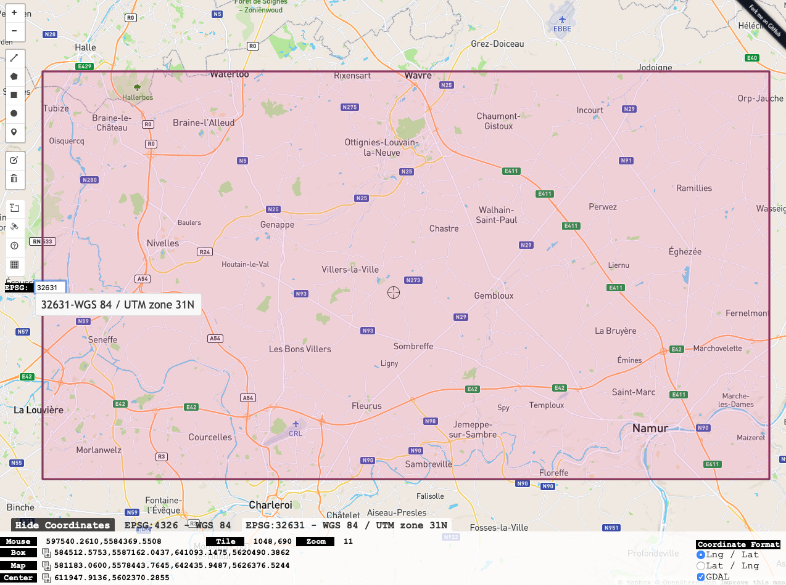

<a href="https://nicolasdeffense.github.io/eo-toolbox/notebooks/1_Region_of_interest/region_of_interest.html"> <i class="fas fa-eye fa-lg"></i></a>
<a href="https://nicolasdeffense.github.io/eo-toolbox/notebooks/1_Region_of_interest/region_of_interest.ipynb"> <i class="fas fa-download fa-lg"></i></a>

The very first step of your project will be to define the area you want to work on. This area is called the **region of interest** (ROI).

We will define our area of interest using a bounding box. To find the coordinates of a bounding box, check: [bboxfinder](http://bboxfinder.com/)


<figure class="image">
  
</figure>

We will build a new shapefile containing the Region of Interest (ROI) from a set of coordinates.


## Coordinates Reference System (CRS)

Geographic CRS| Projected CRS
:---------:|:----------:
span the entire globe | localized to minimize visual distortion <br/> in a particular region
based on a spheroid | based on a plane <br/> *(the spheroid projected onto a 2D surface)*
angular units (degrees) | linear unites (meters)
lat / lon | X / Y
World Geodetic System 1984 <br/> (WGS 84) | Universal Transverse Mercator  <br/> (UTM)
EPSG:4326 | EPSG:32631 (in Belgium)


In bboxfinder, you can easily switch from one CRS to another. As Sentinel images projected onto a WGS84/UTM grid, it is easier to get the coordinates of your ROI directly in WGS84/UTM.

It is important to set the EPSG code matching with the EPSG code of your satellite images!

For instance, if your ROI is located in Belgium,
- the CRS is WGS84 / UTM zone 31N
- the EPSG code is 32631


## Coordinates bounding box

You can easily copy the coordinates of your bounding box via bboxfinder.

```python
bbox    = [627263.7,5596175.1,637115,5590485.2]  # Paste the coordinates here

ulx = bbox[0]  # Upper Left x
uly = bbox[1]  # Upper Left y
lrx = bbox[2]  # Lower Right x
lry = bbox[3]  # Lower Right y
```


<figure class="image">
  
  <figcaption>Extent order in QGIS - ulx, uly : lrx, lry</figcaption>
</figure>


> If you use QGIS 3, you have the ability to add Google Maps (maps, satellite, terrain) layers to your map. This [tutorial](https://socalgis.org/2019/11/06/add-google-maps-to-qgis-3/) shows you how.