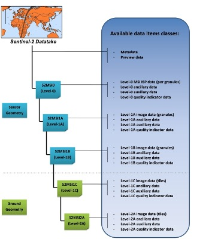
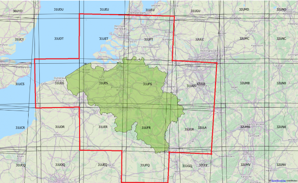
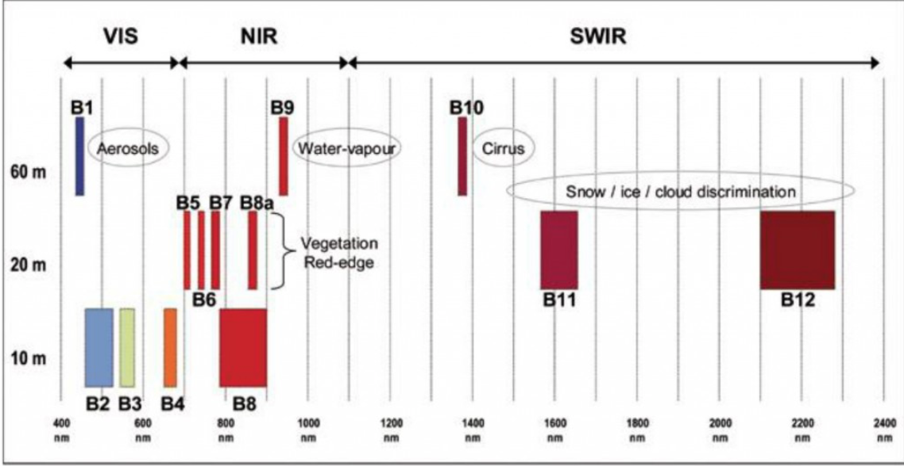
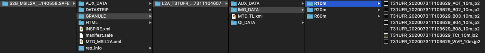

<a href="https://nicolasdeffense.github.io/eo-toolbox/notebooks/4_Sentinel_2_preprocessing/sentinel_2_prepro.html"> <i class="fas fa-eye fa-lg"></i></a>
<a href="https://nicolasdeffense.github.io/eo-toolbox/notebooks/4_Sentinel_2_preprocessing/sentinel_2_prepro.ipynb"> <i class="fas fa-download fa-lg"></i></a>

# Sentinel-2

The *Copernicus Sentinel-2* mission comprises a constellation of two polar-orbiting satellites placed in the same sun-synchronous orbit, phased at 180° to each other. It aims at monitoring variability in land surface conditions, and its wide swath width (290 km) and high revisit time (10 days at the equator with one satellite, and 5 days with 2 satellites under cloud-free conditions which results in 2-3 days at mid-latitudes) will support monitoring of Earth's surface changes.

<figure class="video_container">
  <video width="800" controls="true" allowfullscreen="true">
    <source src="../figures/sentinel_2_orbite.mp4" type="video/mp4">
  </video>
</figure>

<iframe src="https://www.esa.int/content/view/embedjw/473937" width="640" height="360" frameborder="0"></iframe>

## Processing Levels

### Level-1C
**Level-1C** product provides orthorectified *Top-Of-Atmosphere* (TOA) reflectance, with sub-pixel multispectral registration. Cloud and land/water masks are included in the product.

### Level-2A
**Level-2A** product provides orthorectified *Bottom-Of-Atmosphere* (BOA) reflectance, with sub-pixel multispectral registration. A Scene Classification map (cloud, cloud shadows, vegetation, soils/deserts, water, snow, etc.) is included in the product.

The Level-2A operational processor ([Sen2Cor](http://step.esa.int/main/snap-supported-plugins/sen2cor/)) generates Level-2A (BOA reflectance) products from Level-1C products.
This processing is split into two parts:
- Scene Classification (SC) algorithm aims at providing a pixel classification map
- Atmospheric Correction (S2AC) aims at transforming TOA reflectance into BOA reflectance.

> From the mid-March 2018, the Level-2A became an operational product, beginning with coverage of the Euro-Mediterranean region. Global coverage started in December 2018.

<figure class="image">
  
  <figcaption>Sentinel-2 processing levels. Only Level-1C and Level-2A products (in green) are made available to users</figcaption>
</figure>

Level-1C and Level-2A are projected onto a UTM/WGS84 grid and made available publicly on 100x100 km2 tiles. Each tile has a unique ID. Take a look on the Sentinel-2 UTM tiling grid by clicking [here](https://eatlas.org.au/data/uuid/f7468d15-12be-4e3f-a246-b2882a324f59) !

<figure class="image">
  
  <figcaption>Sentinel-2 tiles in Belgium. 3 tiles cover the majority of the Belgian territory: 31UES, 31UFS and 31UFR</figcaption>
</figure>

## Spectral bands & Spatial resolution

The spatial resolution of Sentinel-2 is dependent on the particular spectral band.

|10m spatial resolution | 20m spatial resolution | 60m spatial resolution|
|:---------:|:----------: |:----------: |
| B2 (490 nm) | B5 (705 nm) | B1 (443 nm)
| B3 (560 nm) | B6 (740 nm) | B9 (940 nm)
| B4 (665 nm) | B7 (783 nm) | B10 (1375 nm)
| B8 (842 nm)| B8a (865 nm)
| | B11 (1610 nm)
| | B12 (2190 nm)

<figure class="image">
  
  <figcaption>Sentinel-2 spectral bands</figcaption>
</figure>

# Data Formats

Sentinel-2 products are made available to users in *SENTINEL-SAFE* format, including image data in JPEG2000 format, quality indicators (e.g. defective pixels mask), auxiliary data and metadata.

The SAFE format has been designed to act as a common format for archiving and conveying data within ESA Earth Observation archiving facilities. The SAFE format wraps a folder containing image data in a binary data format and product metadata in XML. This flexibility allows the format to be scalable enough to represent all levels of SENTINEL products.

A Sentinel-2 product refers to a directory folder that contains a collection of information. It includes:
- a manifest.safe file which holds the general product information in XML
- a preview image in JPEG2000 format
- subfolders for measurement datasets including image data (granules/tiles) in GML-JPEG2000 format
- subfolders for datastrip level information
- a subfolder with auxiliary data (e.g. International Earth Rotation & Reference Systems (IERS) bulletin)
- HTML previews

## Level-2 Data Format

The Level-2A prototype product is an orthorectified product providing Bottom-Of-Atmosphere (BOA) reflectances, and basic pixel classification (including classes for different types of cloud).

The Level-2A image data product uses the same tiling, encoding and filing structure as Level-1C.

The Level-2 product is also in SAFE format, which groups together several types of file:
- metadata file (XML file)
- preview image (JPEG2000 with GML geo-location)
- tiles files with BOA reflectances image data file (GML / JPEG2000) for each tile
- datastrip files
- auxiliary data
- ancillary data (Ground Image Processing Parameters (GIPPs))

<figure class="image">
  
  <figcaption>SAFE folder</figcaption>
</figure>

> Before strating this notebook, you should download Sentinel-2 Level-2A products. The L2A products are downloadable by tiles which are 100x100 km2 ortho-images in UTM/WGS84 projection.

# Sentinel-2 L2A preprocessing

The different preprocessing step are as following :

1. Resample 20m spatial resolutions bands to 10m (if you want to work with Red, Green, Blue, NIR bands)
2. Cropping images to the extent of Region of Interest (ROI)
3. Apply Scene Classification map (SCL) on reflectance images to mask invalid pixels

<figure class="image">
  
</figure>

## 1. Resample 20m spatial resolutions bands

| Methods | Type of data | How it works |
|:---------:|:----------:| ---- |
| Nearest Neighbor | categorical| The value of of the output cell is determined by the nearest cell center on the input grid |
| Bilinear Interpolation | continuous |  Weighted average of the four nearest cell centers.   The closer an input cell center is to the output cell center, the higher the influence of its value is on the output cell value. The output value could be different than the nearest input but is always within the same range of values as the input.|
| Cubic Convolution | continuous | Looks at the 16 nearest cell centers to the output and fits a smooth curve through the points to find the value.  Not only does this change the values of the input but it could also cause the output value to be outside of the range of input values (imagine a sink or a peak occurring on a surface). |

## 2. Cropping images to the ROI extent

We can use our ROI (vector) to crop satellite images (raster) into a smaller area to reduce image storage and speed up further processing.

## 3. Atmospheric correction & Cloud screening

### 3.1 Atmospheric correction

Atmospheric correction allows calculation of Bottom Of Atmosphere (BOA) reflectance from Top Of Atmosphere (TOA) reflectance images available in L1C products. For Sentinel-2 images, we will directly use the L2A data as available from the ground segment

### 3.2 Cloud screening

Reliable identification of clouds and cloud shadows are necessary for any optical remote sensing image analysis, especially in operational and fully automatic setups. The cloud screening can be achieved using different algorithms (Sen2Cor, MAJA, Fmask). In this course we will work with Sen2Cor as the mask is already present in L2A products.

Scene Classification (SC) aims at providing a pixel classification map (cloud, cloud shadows, vegetation, soils/deserts, water, snow, etc.)

The SC algorithm enables:
- generation of a classification map which includes four different classes for clouds (including cirrus) and six different classifications for shadows, cloud shadows, vegetation, soils/deserts, water and snow
- provision of associated quality indicators corresponding to a map of cloud probability and a map of snow probability.

SCL class| Description
:---------:|:----------:
0| No data
1| Saturated or defective
2|	Dark area pixels
3|	Cloud shadows
4|	Vegetation
5|	Not vegetated
6|	Water
7|	Unclassified
8|	Cloud medium probability
9|	Cloud high probability
10|	Thin cirrus
11|	Snow
