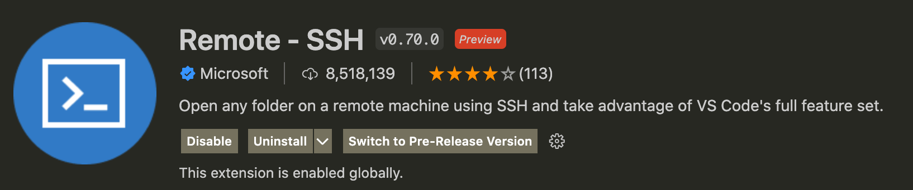
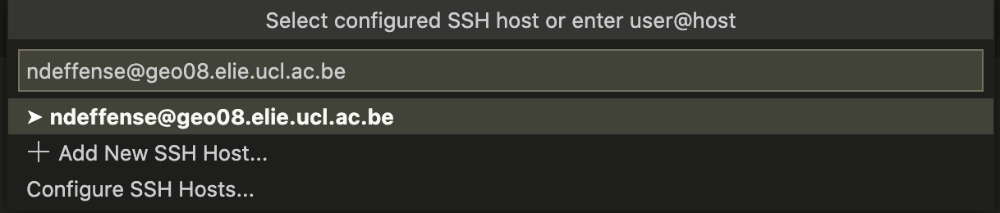
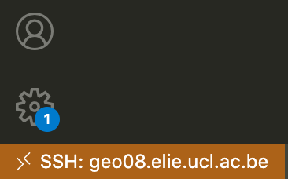
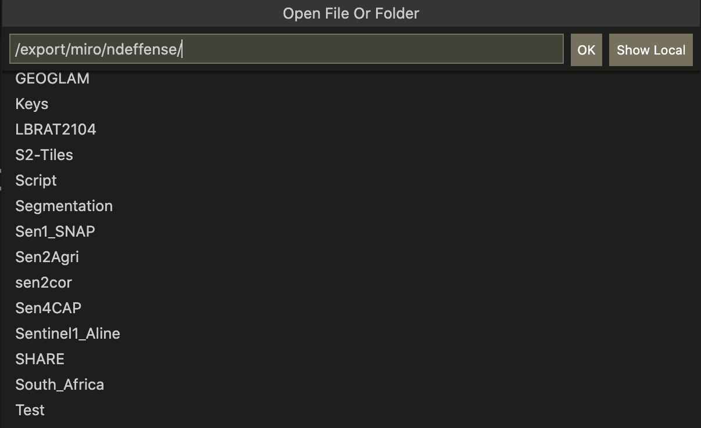

1. [Install](https://code.visualstudio.com/download) the code editing - Visual Studio Code in your personnal computer (PC or Mac)

2. Install **Remote - SSH** extension to open any folder on a remote machine using SSH

    

3. Select **Remote-SSH: Connect to Host...** from the Command Palette (F1, ⇧⌘P) and type `user@geo08.elie.ucl.ac.be`. Then, you have to select the platform of the remote host, in this case it is **Linux**. You also need to type your password.

    

4. After a moment, VS Code will connect to the SSH server and set itself up. If the connection is successful, you will see it at the   bottom left of your screen.

    

5. You can then open any folder on the remote machine using **File > Open...** just as you would locally!

        

6. Visual Studio Code supports working with Jupyter Notebooks natively. Click [here](https://code.visualstudio.com/docs/datascience/jupyter-notebooks) to get more information.
    > You may need to install **Jupyter** and **Jupyter Notebook Renderers** extensions !

7. Visual Studio Code includes a fully-featured integrated terminal. You can directly use this terminal to browse your files or to install python libraries using `pip install {library_name}`.  
To open the terminal:
    - Use the ⌃` keyboard shortcut with the backtick character.
    - Use the View > Terminal menu command.
    - From the Command Palette (⇧⌘P), use the View: Toggle Terminal command.
    - You can create a new terminal via the Terminal menu with Terminal > New Terminal   
