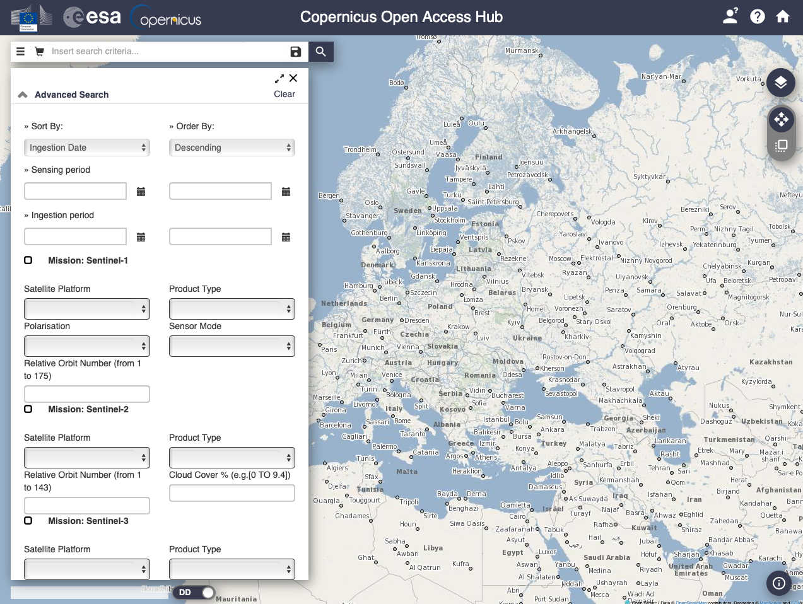

# Download EO data

Once the ROI (*Region of Interest*) has been defined, the EO (*Earth Observation*) data must be downloaded.

## Copernicus Open Access Hub - SciHub

The *Copernicus Open Access Hub* provides complete, free and open access to Sentinel-1, Sentinel-2, Sentinel-3 and Sentinel-5P user products.

### Access from the website

### Access from the Sentinelsat Python API

`sentinelsat` makes searching, downloading and retrieving the metadata of Sentinel satellite images from the [Copernicus Open Access Hub](https://scihub.copernicus.eu) easy.

## Luxembourg Space Agency (LSA) Data Center

The [LSA Data Center](https://collgs.lu)  is the Luxembourg entry point to data products of Sentinel 1 and Sentinel 2 constellations.

The LSA Data Center allows the users to search, discover and download the data. To this purpose all the data are referenced and indexed in a real time updated geo-catalogue. The catalogue allows the users to query the archive on the basis of specific criteria such as product type, orbit, cloud coverage or polarisation mode and to select the needed products for the download.