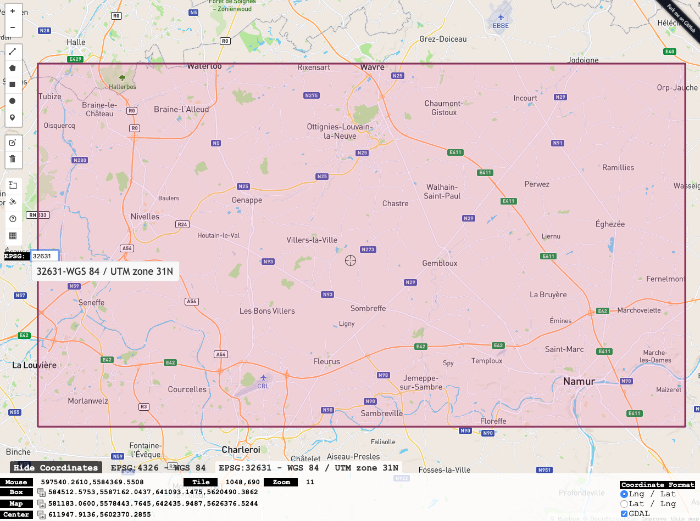

<a href="https://nicolasdeffense.github.io/eo-toolbox/notebooks/1_Region_of_interest/region_of_interest.html"> <i class="fas fa-eye fa-lg"></i></a>
<a href="https://nicolasdeffense.github.io/eo-toolbox/notebooks/1_Region_of_interest/region_of_interest.ipynb"> <i class="fas fa-download fa-lg"></i></a>

The very first step of your project will be to define the area you want to work on. This area is called the **region of interest** (ROI).

We will define our area of interest using a bounding box. To find the coordinates of a bounding box, check: [bboxfinder](http://bboxfinder.com/)

<figure class="image">
  
</figure>

We will build a new shapefile containing the Region of Interest (ROI) from a set of coordinates.

### Choose the CRS of the new shapefile - crs_dst

It is important to set the EPSG code matching with the EPSG code of your satellite images!

For instance, if your ROI is located in Belgium,
- the CRS is WGS 84 / UTM zone 31N
- the EPSG code is 32631

### Choose the CRS of the coordinates - crs_src

- Degree - WGS84 - EPSG:4326
- Meters - WGS 84 / UTM zone 31N - EPSG:32631 (RECOMMANDED)

### Coordinates bounding box

Extent in QGIS --> ulx, uly : lrx, lry

- ulx = Upper Left x
- uly = Upper Left y
- lrx = Lower Right x
- lry = Lower Right y

<figure class="image">
  
</figure>

> If you use QGIS 3, you have the ability to add Google Maps (maps, satellite, terrain) layers to your map. This [tutorial](https://socalgis.org/2019/11/06/add-google-maps-to-qgis-3/) shows you how.