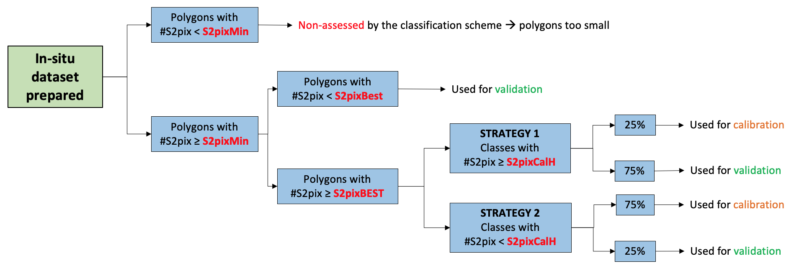

## 1. In situ data preparation

<a href="https://nicolasdeffense.github.io/eo-toolbox/notebooks/7_Classification/in_situ_preparation.html"> <i class="fas fa-eye fa-2x"></i></a>
<a href="https://nicolasdeffense.github.io/eo-toolbox/notebooks/7_Classification/in_situ_preparation.ipynb"> <i class="fas fa-download fa-2x"></i></a>

<figure class="image">
  
  <figcaption>In situ preparation</figcaption>
</figure>

## 2. In situ data sampling design

<a href="https://nicolasdeffense.github.io/eo-toolbox/notebooks/7_Classification/in_situ_sampling_design.html"> <i class="fas fa-eye fa-2x"></i></a>
<a href="https://nicolasdeffense.github.io/eo-toolbox/notebooks/7_Classification/in_situ_sampling_design.ipynb"> <i class="fas fa-download fa-2x"></i></a>

The two main purposes of the *in situ* data collection are referred to as algorithm calibration and output validation.

The training and validation data set should be completely different and spatially independent. *In situ* data are split into two subsets, the first one used for training the algorithm, the second one used to assess the quality of the output. This would be a proper validation data set only if all of the samples were distributed over the entire area of interest and then randomly split into calibration and validation subsets.

## Calibration

The sampling objective for the calibration data set is to encompass the entire diversity of situations existing in the region of interest to represent the range of possible spectral and temporal signatures. To produce an agricultural land mask delineating cropland versus non-cropland, all land cover types must be included in the calibration data set. Otherwise, the non-documented land cover types are allocated to the cropland or non-cropland class in an uncontrolled manner.

The samples are targeted to establish the necessary links between a given landscape type (wetlands, urban area, water, etc.) and the existing range of corresponding spectral and temporal signatures. 

## Validation

The objective of a validation data set is to provide a statistically sound estimate of the accuracy of the output map based on an independent reference information source. The accuracy of a map is assessed by measuring the degree of agreement between the output map and the validation data set.
Several metrics of classification accuracy can be derived from the confusion matrix, which corresponds to a two- dimensional contingency table matching the mapped and observed class for each sample.

<figure class="image">
  
  <figcaption>In situ sampling design</figcaption>
</figure>

---

[Handbook on remote sensing for agricultural statistics](https://www.researchgate.net/publication/319876837_Handbook_on_remote_sensing_for_agricultural_statistics)