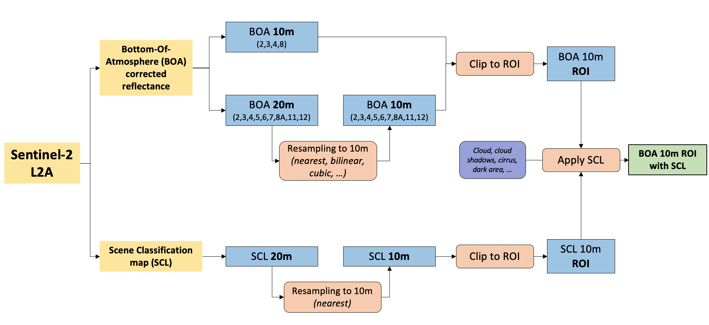

<a href="https://nicolasdeffense.github.io/eo-toolbox/notebooks/4_Sentinel_2_preprocessing/sentinel_2_prepro.html"> <i class="fas fa-eye fa-lg"></i></a>
<a href="https://nicolasdeffense.github.io/eo-toolbox/notebooks/4_Sentinel_2_preprocessing/sentinel_2_prepro.ipynb"> <i class="fas fa-download fa-lg"></i></a>

The *Copernicus Sentinel-2* mission comprises a constellation of two polar-orbiting satellites placed in the same sun-synchronous orbit, phased at 180° to each other. It aims at monitoring variability in land surface conditions, and its wide swath width (290 km) and high revisit time (10 days at the equator with one satellite, and 5 days with 2 satellites under cloud-free conditions which results in 2-3 days at mid-latitudes) will support monitoring of Earth's surface changes.

> Before strating this notebook, you should download a Sentinel-2 Level-2A product in <a href="https://scihub.copernicus.eu/dhus/#/home" target="_blank">Copernicus Open Access Hub</a>. The L2A products are downloadable by tiles which are 100x100 km2 ortho-images in UTM/WGS84 projection.

The different preprocessing step are as following :

1. Resample images at 20m to 10m (if you want to work with Red, Green, Blue, NIR bands)
2. Clip images to the extent of Region of Interest (ROI)
3. Apply Scene Classification map (SCL) on reflectance images to mask invalid pixels

<figure class="image">
  
</figure>

## 1. Resample

| Methods | Type of data | How it works |
|:---------:|:----------:| ---- |
| Nearest Neighbor | categorical| The value of of the output cell is determined by the nearest cell center on the input grid |
| Bilinear Interpolation | continuous |  Weighted average of the four nearest cell centers. The closer an input cell center is to the output cell center, the higher the influence of its value is on the output cell value. The output value could be different than the nearest input but is always within the same range of values as the input.|
| Cubic Convolution | continuous | Looks at the 16 nearest cell centers to the output and fits a smooth curve through the points to find the value. Not only does this change the values of the input but it could also cause the output value to be outside of the range of input values (imagine a sink or a peak occurring on a surface). |

## 2. Clip

## 3. Apply cloud mask

