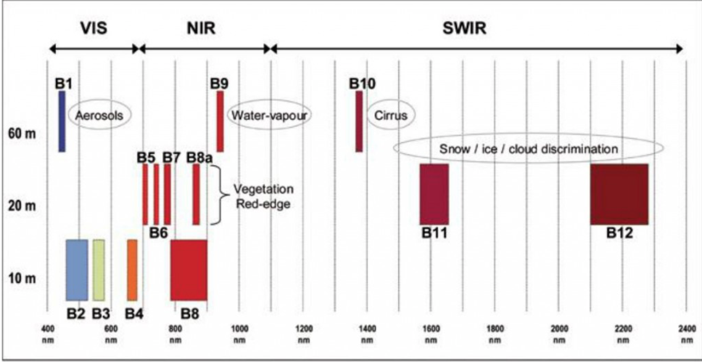

<a href="https://nicolasdeffense.github.io/eo-toolbox/notebooks/4_Sentinel_2_preprocessing/sentinel_2_prepro.html"> <i class="fas fa-eye fa-lg"></i></a>
<a href="https://nicolasdeffense.github.io/eo-toolbox/notebooks/4_Sentinel_2_preprocessing/sentinel_2_prepro.ipynb"> <i class="fas fa-download fa-lg"></i></a>

The *Copernicus Sentinel-2* mission comprises a constellation of two polar-orbiting satellites placed in the same sun-synchronous orbit, phased at 180° to each other. It aims at monitoring variability in land surface conditions, and its wide swath width (290 km) and high revisit time (10 days at the equator with one satellite, and 5 days with 2 satellites under cloud-free conditions which results in 2-3 days at mid-latitudes) will support monitoring of Earth's surface changes.

The spatial resolution of SENTINEL-2 is dependent on the particular spectral band:
- 10m spatial resolution bands:
  - B2 (490 nm)
  - B3 (560 nm)
  - B4 (665 nm)
  - B8 (842 nm)
- 20m spatial resolution bands:
  - B5 (705 nm)
  - B6 (740 nm)
  - B7 (783 nm)
  - B8a (865 nm)
  - B11 (1610 nm)
  - B12 (2190 nm)
- 60m spatial resolution bands:
  - B1 (443 nm)
  - B9 (940 nm)
  - B10 (1375 nm)

<figure class="image">
  
  <figcaption>Sentinel-2 spectral bands</figcaption>
</figure>

> Before strating this notebook, you should download Sentinel-2 Level-2A products. The L2A products are downloadable by tiles which are 100x100 km2 ortho-images in UTM/WGS84 projection.

The different preprocessing step are as following :

1. Resample 20m spatial resolutions bands to 10m (if you want to work with Red, Green, Blue, NIR bands)
2. Cropping images to the extent of Region of Interest (ROI)
3. Apply Scene Classification map (SCL) on reflectance images to mask invalid pixels

<figure class="image">
  
</figure>

## 1. Resample 20m spatial resolutions bands

| Methods | Type of data | How it works |
|:---------:|:----------:| ---- |
| Nearest Neighbor | categorical| The value of of the output cell is determined by the nearest cell center on the input grid |
| Bilinear Interpolation | continuous |  Weighted average of the four nearest cell centers. The closer an input cell center is to the output cell center, the higher the influence of its value is on the output cell value. The output value could be different than the nearest input but is always within the same range of values as the input.|
| Cubic Convolution | continuous | Looks at the 16 nearest cell centers to the output and fits a smooth curve through the points to find the value. Not only does this change the values of the input but it could also cause the output value to be outside of the range of input values (imagine a sink or a peak occurring on a surface). |

## 2. Cropping images to the ROI extent

We can use our ROI (vector) to crop satellite images (raster) into a smaller area to reduce image storage and speed up further processing.

## 3. Atmospheric correction & Cloud screening

### 3.1 Atmospheric correction

Atmospheric correction allows calculation of Bottom Of Atmosphere (BOA) reflectance from Top Of Atmosphere (TOA) reflectance images available in L1C products. For Sentinel-2 images, we will directly use the L2A data as available from the ground segment

### 3.2 Cloud screening

Reliable identification of clouds and cloud shadows are necessary for any optical remote sensing image analysis, especially in operational and fully automatic setups. The cloud screening can be achieved using different algorithms (Sen2Cor, MAJA, Fmask). In this course we will work with Sen2Cor as the mask is already present in L2A products.

Scene Classification (SC) aims at providing a pixel classification map (cloud, cloud shadows, vegetation, soils/deserts, water, snow, etc.)

The SC algorithm enables:

generation of a classification map which includes four different classes for clouds (including cirrus) and six different classifications for shadows, cloud shadows, vegetation, soils/deserts, water and snow
provision of associated quality indicators corresponding to a map of cloud probability and a map of snow probability.

SCL class| Description
:---------:|:----------:
0| No data
1| Saturated or defective
2|	Dark area pixels
3|	Cloud shadows
4|	Vegetation
5|	Not vegetated
6|	Water
7|	Unclassified
8|	Cloud medium probability
9|	Cloud high probability
10|	Thin cirrus
11|	Snow
